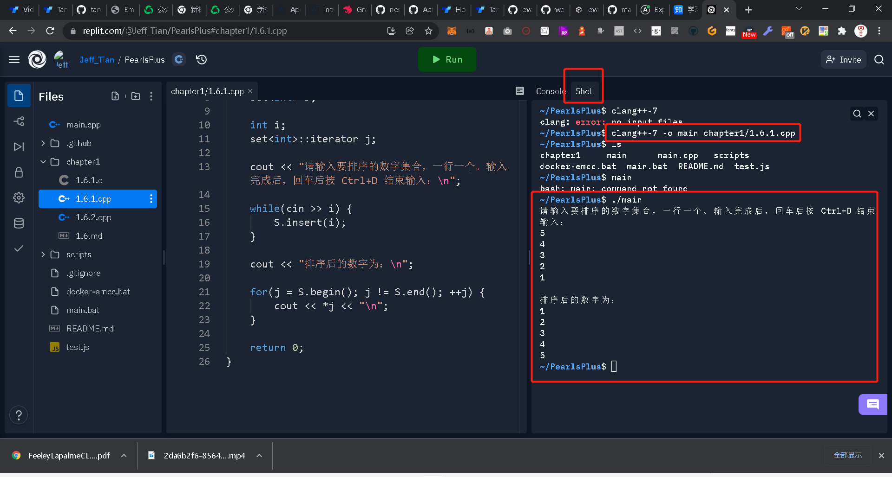

# PearlsPlus

---

> **《编程珠玑》习题集**

## 在线访问

https://pearlsplus.pa-ca.me/chapter1/1.6.1.html

## 在微信小程序里访问


## 在线编辑

https://replit.com/@Jeff_Tian/PearlsPlus

要运行一个指定的程序文件，可以在 Shell 里使用如下命令：

```shell
clang++-7 -o main chapter1/1.6.1.cpp
./main
```

如果是 c 文件，则要用这个命令：

```shell
clang-7 -o main chapter1/1.6.1.c
./main
```



## 相关专栏

- https://zhuanlan.zhihu.com/p/463606921